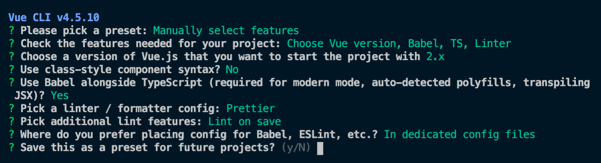

# Vue Todo With Typescript

## 학습한 내용

- Vue + Typescript 프로젝트 생성 방법

- 뷰 타입스크립트 프로젝트 기본 구조
- 재활용성을 고려한 공통 컴포넌트 설계 방법(인풋, 목록 아이템)
  - 인풋 태그의 한글 입력 처리 방법
- `.vue` 파일에서의 타입스크립트 정의 방식
  - `data`
  - `methods`
  - `props`
  - `computed`
- 타입스크립트를 사용했을 때의 이점